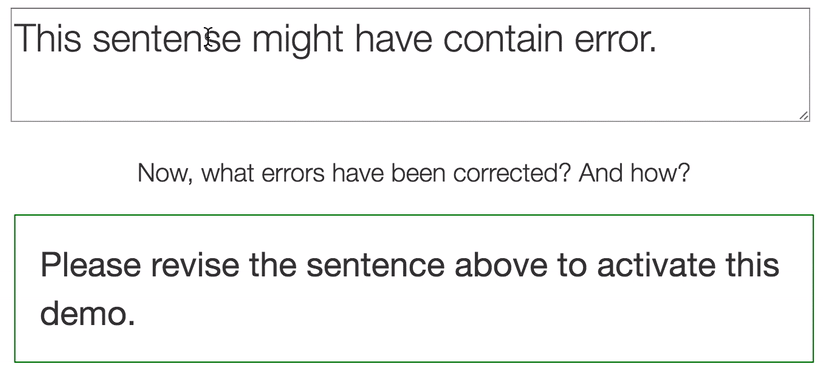

# Correction Detector

Want to summarize your revisions to a sentence?



### Install

Starting the JSON-RPC server at port 8085, in two lines, with [Docker](http://www.docker.com)

```sh
$ docker pull xuehuichao/correction_detector
$ docker run -d -p 8085:8085 xuehuichao/correction_detector
```

### Usage

Compare two sentences with a json-rpc request. The server will respond with how many corrections were made, and the revision types.
```sh
$ curl --data-binary '{"params" : ["This sentence might have contain error.", "This sentence might have some errors."], "id" : 0, "jsonrpc" : "2.0", "method" : "CorrDet"}' -H 'content-type:text/plain;' http://127.0.0.1:8085

{"jsonrpc": "2.0", "result": [["This sentence might have", null, null], ["contain", "some", "needs replacing"], ["error", "errors", "wrong noun form"], [".", null, null]], "id": 0}
```

You may also experience the demo above on your local machine, by opening `demo.html` in your faviorate browser.


## Intro


My algorithm compares an input sentence with its revision and figure out what errors have been corrected. We described the system in our [ACL 2014's paper](http://acl2014.org/acl2014/P14-2/pdf/P14-2098.pdf). Our system improved over a previous system by Swanson and Yamagil (2012).

The detector was described in our paper in ACL 2014. Please feel free to use the following citation information:

    @inproceedings{XueAndHwaACL2014,
      title={Improved Correction Detection in Revised {ESL} Sentences},
      author={Xue, Huichao and Hwa, Rebecca},
      booktitle={Proceedings of the 52nd Annual Meeting of the Association for Computational Linguistics (ACL)},
      year={2014},
      address   = {Baltimore, MD, USA},
      organization={Association for Computational Linguistics}
    }
	
Note that I trained the models for correction extraction and error type selection on FCE corpus [Here](http://ilexir.co.uk/applications/clc-fce-dataset/). Please review their licence terms before using this software package.


## References
1. Yannakoudakis, H., Briscoe, T., & Medlock, B. (2011, June). A new dataset and method for automatically grading ESOL texts. In Proceedings of the 49th Annual Meeting of the Association for Computational Linguistics: Human Language Technologies-Volume 1 (pp. 180-189). Association for Computational Linguistics.
Chicago	
2. Swanson, B., & Yamangil, E. (2012, June). Correction detection and error type selection as an ESL educational aid. In Proceedings of the 2012 Conference of the North American Chapter of the Association for Computational Linguistics: Human Language Technologies (pp. 357-361). Association for Computational Linguistics.
